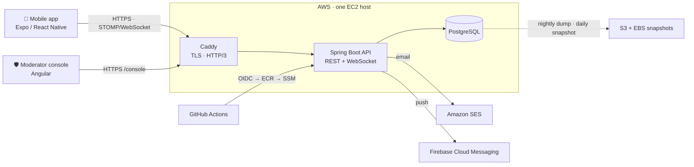

# DevHub · Backend

**The API behind DevHub, a social network for developers.** Accounts, the follow graph, a
feed of posts with code, realtime chat, push notifications and a moderation pipeline,
running on AWS and deployed from GitHub with no stored cloud keys.

[](https://github.com/GitSter-dev/devhub-backend/actions/workflows/deploy.yml)


Part of DevHub: [Mobile app](https://github.com/GitSter-dev/devhub-app) · **Backend** · [Moderator console](https://github.com/GitSter-dev/devhub-console)

## How it fits together



## What it does

- **Accounts**: sign-up with email verification, login, password reset, and account
  deletion with a 30-day window to change your mind.
- **Social graph**: pick the topics you care about, follow people, get suggestions based on
  shared interests, search profiles.
- **Feed and posts**: posts with code blocks, threaded replies and likes, paged with stable cursors.
- **Chat**: direct and group conversations with message requests, typing indicators and
  read receipts, all delivered live over WebSocket.
- **Notifications**: in-app and push, batched into digests so a popular post doesn't
  flood someone's phone.
- **Safety**: blocking, reporting, and a moderation queue with a full audit trail, worked
  through the [moderator console](https://github.com/GitSter-dev/devhub-console).

## Engineering highlights

- **Sessions that can't be silently stolen.** Access tokens are short-lived RS256 JWTs. Refresh
  tokens rotate on every use and are stored only as hashes; replaying an old one ends the session.
- **Auth that doesn't leak who's registered.** Login, sign-up and password reset answer the
  same way whether or not an email exists.
- **No lost or duplicated emails.** Side effects go through a transactional outbox drained
  with `SELECT … FOR UPDATE SKIP LOCKED`, with retries and backoff.
- **Safe retries from flaky mobile networks.** Write endpoints accept an `Idempotency-Key`,
  and 15 named rate-limit policies protect login, posting, messaging and more.
- **Realtime with the same security as REST.** The STOMP connection is authenticated with the
  JWT, every subscription is authorised, and sockets close when their session ends.
- **One predictable API shape.** Every response, including errors, is an `ApiEnvelope` with a
  stable error code; every endpoint and error is documented in OpenAPI.
- **Operable in production.** Infrastructure is Terraform. Deploys roll back on a failed health
  check. Backups go to S3 nightly, and the [restore drill](deploy/RESTORE.md) has been run.

## Tech stack

| Area | Choices |
|---|---|
| Language & framework | Java 21, Spring Boot 4.1 (Web MVC, Security, Data JPA, WebSocket) |
| Data | PostgreSQL 18, Flyway (19 migrations), keyset pagination |
| Auth | OAuth2 resource server, RS256 JWT, rotating refresh tokens |
| Messaging & jobs | Transactional outbox, scheduled jobs, STOMP over WebSocket |
| Integrations | Amazon SES (email), Firebase Cloud Messaging (push), Thymeleaf email templates |
| Resilience | Bucket4j + Caffeine rate limiting, idempotency keys |
| Infrastructure | AWS (EC2, ECR, SSM, SES, S3, DLM) via Terraform, Caddy, Docker |
| Observability | OpenTelemetry (OTLP) metrics and traces, Grafana dashboards |
| CI/CD | GitHub Actions with OIDC, Testcontainers |

## Run it locally

You need Java 21 and Docker.

```bash
cp .env.example .env   # local defaults work as-is
./start.sh             # generates JWT keys, starts Postgres + Mailpit, runs the app
```

- API: http://localhost:8080, with interactive docs at http://localhost:8080/swagger-ui.html
- Emails (verification codes etc.): http://localhost:8025 (Mailpit)
- Metrics and traces: http://localhost:3000 (Grafana, with the DevHub dashboard preloaded)
- A Postman collection with 130+ scenario requests lives in [`postman/`](postman/)

## Testing & delivery

- **277 integration tests** run against real PostgreSQL and a real mail server in
  Testcontainers. The tests read the actual verification emails. Run them with `./mvnw verify`.
- Every pull request runs the full suite. Every merge to `main` builds an image, pushes it to
  ECR and rolls it out over SSM, with an automatic rollback if the new version isn't healthy.

<details>
<summary><b>Project layout</b></summary>

Packages are organised by feature under `src/main/java/com/application/devhub`:

| Package | Responsibility |
|---|---|
| `auth`, `session`, `security`, `otp`, `verification`, `passwordreset` | Sign-up, login, token rotation, one-time codes |
| `user`, `profile`, `topic`, `follow`, `suggestion` | Identity and the social graph |
| `post` | Posts, replies, likes, feed |
| `chat`, `realtime` | Conversations and the WebSocket layer |
| `notification`, `push`, `device`, `mail` | In-app, push and email delivery |
| `block`, `moderation`, `admin` | Safety tooling and the moderation API |
| `account` | Deletion, restore and purge lifecycle |
| `outbox`, `idempotency`, `ratelimit`, `common` | Cross-cutting infrastructure |

Operations docs:
- [`deploy/RELEASING.md`](deploy/RELEASING.md): cutting releases and retiring old app versions
- [`deploy/OBSERVABILITY.md`](deploy/OBSERVABILITY.md): metrics, traces and dashboards
- [`deploy/RESTORE.md`](deploy/RESTORE.md): backups and restores
- [`deploy/ADMIN.md`](deploy/ADMIN.md): granting moderator access
- [`docs/decisions/`](docs/decisions/): architecture decisions

Infrastructure lives in [`terraform/`](terraform/).

</details>

---

© 2026 [GProgrammer1](https://github.com/GProgrammer1). The source is public for review but not licensed for reuse.
